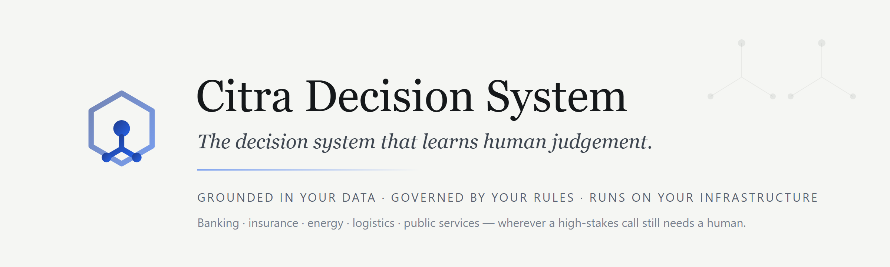
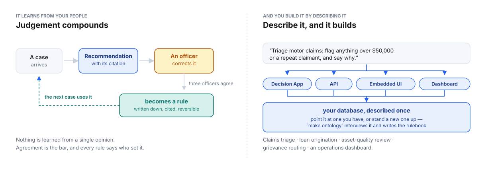
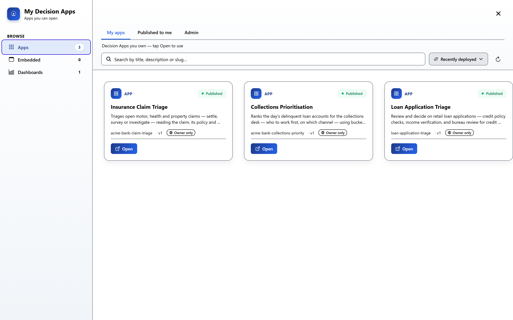
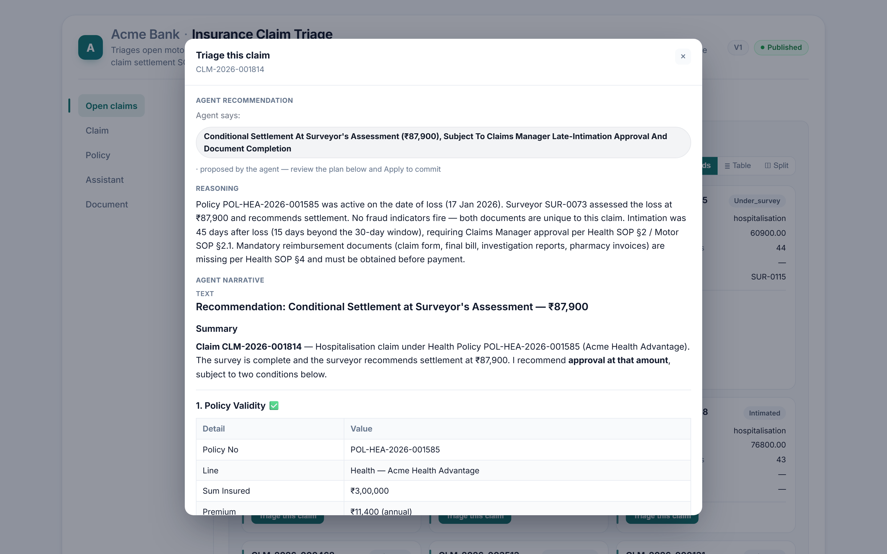
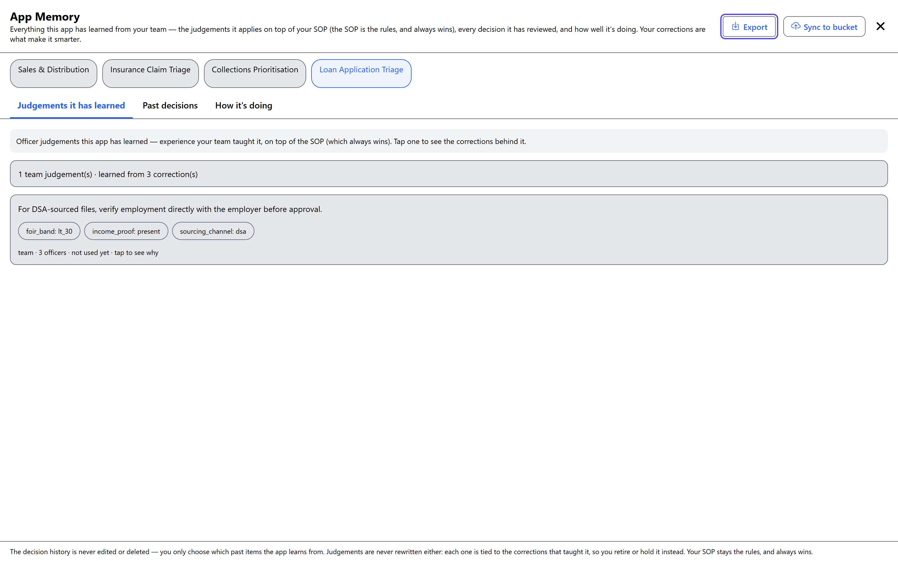

<!--
  Copyright (c) 2026 Trustedwear Tech Private Limited (https://citra-ai.com)
  Author: Rohit Kumar Chandan
  SPDX-License-Identifier: Apache-2.0

  Licensed under the Apache License, Version 2.0 (the "License"); you may not
  use this file except in compliance with the License. You may obtain a copy of
  the License at http://www.apache.org/licenses/LICENSE-2.0
-->

<p align="center">
  <picture>
    <source media="(prefers-color-scheme: dark)" srcset="assets/banner-dark.png">
    <source media="(prefers-color-scheme: light)" srcset="assets/banner-light.png">
    
  </picture>
</p>

<p align="center">
  <a href="https://github.com/Trustedwear-Tech/citra-decision-system/actions/workflows/ci.yml"></a>
  <a href="LICENSE"></a>
  
  
  <a href="https://discordapp.com/channels/1519703038724669551/1535992242433433700"></a>
</p>

<p align="center">
  <b><a href="#run-it-in-10-minutes">Quickstart</a> ·
  <a href="#describe-it-and-it-builds">Build an app</a> ·
  <a href="#it-learns-your-peoples-judgement">How it learns</a> ·
  <a href="https://github.com/Trustedwear-Tech/citra-decision-system/wiki">Docs</a> ·
  <a href="https://citra-ai.com">Website</a></b>
</p>

*Sovereign by design — run it in your own infrastructure, on open models. Your
data never leaves.*

<p align="center">
  <picture>
    <source media="(prefers-color-scheme: dark)" srcset="assets/story/0-hero-dark.svg">
    <source media="(prefers-color-scheme: light)" srcset="assets/story/0-hero-light.svg">
    
  </picture>
</p>

**Build the decision app, the API or the embedded card by describing it in
plain English — then watch it get better every time one of your people
corrects it.**

Your SOPs and your data already answer most cases. The ones carrying real
money are settled by an experienced person whose reasoning is written down
nowhere.

**You may already have tried fine-tuning a model for exactly these.** A
fine-tune learns the patterns in the records it was shown, and that is also
its ceiling. In a hard case the deciding factor usually is not in the data:
*the column that would settle it does not exist, and the SOP does not cover
this one.* That is the moment a person takes over, on judgement built over
years and applied exactly where the rules run out.

That judgement is the most valuable asset in the operation and the least
protected. **It lives in one head. It walks out of the door.** Citra puts it in
a ledger you own, and applies it to the next case.

This is a **decision system, not a vertical application** — it carries no
industry logic of its own. What a case is, what evidence counts, what may be
written back and by whom is declared per deployment, which is why the same
engine serves lending, insurance, energy, public services and logistics. The
demo ships as a bank because a runnable demo has to pick one.

→ [Why this exists](https://github.com/Trustedwear-Tech/citra-decision-system/wiki/Why-this-exists)

---

## It learns your people's judgement

Every recommendation arrives with the SOP passage or prior decision that
produced it, so an approver checks the reasoning rather than the answer. When
they override it, the reason is recorded.

**A correction is not a lesson.** One officer having a bad afternoon should
not change how the system decides. When the *same* corrected pattern repeats
across **three distinct officers**, it hardens into a learned judgement:
named, attributed, dated, and reversible. Not a silent weight update — a rule
you can read, cite, and switch off.

The next matching case is recommended against it.

```
recommendation → officer corrects → three officers agree → a written rule
                                                              ↓
                                          the next case is decided with it
```

Two things come out of that loop, worth separating: the **money** saved by
getting high-stakes calls right, and the **hours** saved by not re-deciding
routine ones. Most tools chase the second. This is built for the first, and
gets the second on the way.

→ [How the learning loop works](https://github.com/Trustedwear-Tech/citra-decision-system/wiki/The-learning-loop) ·
[What the decision ledger records](https://github.com/Trustedwear-Tech/citra-decision-system/wiki/The-decision-ledger)

---

## Describe it, and it builds

Say what you want in plain English. A builder agent drafts the spec against
your data catalogue, asks about what it cannot infer, and publishes when you
accept. One published spec, four ways to use it:

| | |
|---|---|
| **Decision App** | A working case queue: case pages, live dashboards, a plain-English copilot. |
| **API** | Every recommendation, score, reason and the learning loop itself, over REST. Call it from a system you already run. |
| **Embedded UI** | Drop the recommendation and its reasoning into your existing LOS, CRM or core screen. Your team never changes tools. |
| **Dashboard** | Live operational views over the same governed data. |

People have built claim triage, loan origination, asset-quality review,
grievance routing and operations dashboards this way. The shape of the work
does not change — only the ontology does.

### Your data, described once

The system needs to know what your tables *mean* — which one records
decisions already made, what a document column actually is, which column is
money. A schema scan cannot infer that.

```bash
make ontology                # interviews a live database, writes sources.json
```

**Point it at a database you already run, or stand a new one up.** Spinning up
a database takes minutes; designing a schema that reflects your business takes
days. Everything after that — the ontology, the catalogue, the app, the API,
the embedded card, the governance, the learning — is what this repository is.

The result is one reviewable file per deployment. It is safe to commit; secrets
stay in the environment.

→ [Build an app, API or embedded UI](https://github.com/Trustedwear-Tech/citra-decision-system/wiki/Build-apps-APIs-and-embedded-UI) ·
[Connect your data](https://github.com/Trustedwear-Tech/citra-decision-system/wiki/Connect-your-data)

---

## Run it in 10 minutes

```bash
curl -sSL https://github.com/Trustedwear-Tech/citra-decision-system/archive/refs/tags/v0.4.1.tar.gz | tar xz
cd citra-decision-system-0.4.1
make wizard
```

A `git clone` works identically. The wizard checks your host first and stops
before writing anything if a prerequisite is missing, asks for one API key,
builds every image from source, and seeds a worked bank demo: five
departments, a policy corpus, and four Decision Apps you can open and drive.

> **The demo is a hypothetical Indian bank**, so screenshots show rupee
> amounts and Indian digit grouping. Nothing in the platform is tied to
> that: currency, date order and ID checksums come from the country pack,
> and packs ship for `IN` and `US` today.

**First run takes 20–40 minutes**, nearly all of it compiling images. Cached
after that.

You need Docker Engine 24+ with Compose v2, 16 GB RAM, Python 3.9+ with `venv`,
`curl`, and an OpenAI-compatible API key. **Not** Node.js or git — those run
inside the containers.

→ [Install and first run](https://github.com/Trustedwear-Tech/citra-decision-system/wiki/Install-and-first-run) ·
[Troubleshooting](https://github.com/Trustedwear-Tech/citra-decision-system/wiki/Troubleshooting)

---

## What it looks like

Three screens, in the order the work happens. All from the demo the wizard
seeds, on a machine with nothing on it.

**The apps, built and published.** Four of them, from four sentences.

<p align="center">
  
</p>

**A recommendation, with its reasoning and the SOP it cites.** The approver
checks the argument, not just the answer.

<p align="center">
  
</p>

**What it has learned from your people.** Named, attributed, reversible — and
switchable off.

<p align="center">
  
</p>

→ [More screens](https://github.com/Trustedwear-Tech/citra-decision-system/wiki/Install-and-first-run)

---

## Does it actually work?

We ran nineteen agent-sourced loan applications twice — identical inputs, one
learned judgement on, then off — plus control files from other channels where
the correct behaviour is to do nothing.

| | |
|---|---|
| **14 vs 1** | a verification check was raised on 14 files with memory on, 1 with it off |
| **19 of 19** | applied on every file it was meant for |
| **0 of 2** | never fired on a control file |
| **p = 0.0005** | odds of that being luck: about 1 in 2,000 |

It fires where it belongs, stays silent where it does not, and the effect is
not the underlying model. It also found the limits — a lesson that merely
restates the SOP changes nothing, because the SOP already fires.

→ [The full experiment, including the null result](https://github.com/Trustedwear-Tech/citra-decision-system/wiki/The-experiment)

---

## What makes it different

- **A governed ontology, not an open-ended agent.** What the system may build
  and do is bounded up front; every write is schema-validated before it runs.
- **Cited, precedent-backed recommendations.** Every recommendation links back
  to the SOP passage or prior decision that produced it.
- **The agent never writes on its own.** A person approves before anything
  reaches your systems. Autonomy is opt-in, later, and only where you choose.
- **File-defined data sources.** Each deployment reads its own `sources.json`
  — no central service holds your connection strings.
- **Connects to what you already run.** SQL, REST and document stores through
  MCP. No rip-and-replace.

→ [Governance and the sandbox](https://github.com/Trustedwear-Tech/citra-decision-system/wiki/Governance-and-the-sandbox) ·
[Architecture](https://github.com/Trustedwear-Tech/citra-decision-system/wiki/Architecture)

---

## Documentation

| | |
|---|---|
| [Install and first run](https://github.com/Trustedwear-Tech/citra-decision-system/wiki/Install-and-first-run) | Prerequisites per OS, the wizard, what gets built |
| [Build apps, APIs and embedded UI](https://github.com/Trustedwear-Tech/citra-decision-system/wiki/Build-apps-APIs-and-embedded-UI) | The builder, the three surfaces, embedding |
| [Connect your data](https://github.com/Trustedwear-Tech/citra-decision-system/wiki/Connect-your-data) | Databases, the ontology, the catalogue |
| [The learning loop](https://github.com/Trustedwear-Tech/citra-decision-system/wiki/The-learning-loop) | Judgements, clauses, precedent, the ledger |
| [Architecture](https://github.com/Trustedwear-Tech/citra-decision-system/wiki/Architecture) | Services, data flow, what talks to what |
| [Governance and the sandbox](https://github.com/Trustedwear-Tech/citra-decision-system/wiki/Governance-and-the-sandbox) | Policy gates, approvals, isolation |
| [Why this exists](https://github.com/Trustedwear-Tech/citra-decision-system/wiki/Why-this-exists) | The argument: why a fine-tune does not close it |
| [The experiment](https://github.com/Trustedwear-Tech/citra-decision-system/wiki/The-experiment) | Method, results, the null result, limits |
| [Configuration](https://github.com/Trustedwear-Tech/citra-decision-system/wiki/Configuration) | Every environment variable |
| [Operations](https://github.com/Trustedwear-Tech/citra-decision-system/wiki/Operations) | Running it, upgrading, backups |
| [Troubleshooting](https://github.com/Trustedwear-Tech/citra-decision-system/wiki/Troubleshooting) | When something will not start |

---

## Support this project

Citra Decision System is Apache-2.0 and free to run on your own infrastructure,
forever. If it saves you a build, [supporting the
work](https://citra-ai.com/open-source) keeps it maintained and independent.

## License

Apache-2.0. See [LICENSE](LICENSE). Use it in production, commercially, without
asking. The `citra-common` packages vendored under `citra-common/` are
Apache-2.0 too.

## Community

Questions and bug reports: [Issues](https://github.com/Trustedwear-Tech/citra-decision-system/issues).
Conversation: [Discord](https://discordapp.com/channels/1519703038724669551/1535992242433433700).

## About

Built by [Trustedwear Tech Private Limited](https://citra-ai.com) ·
contact@citra-ai.com
