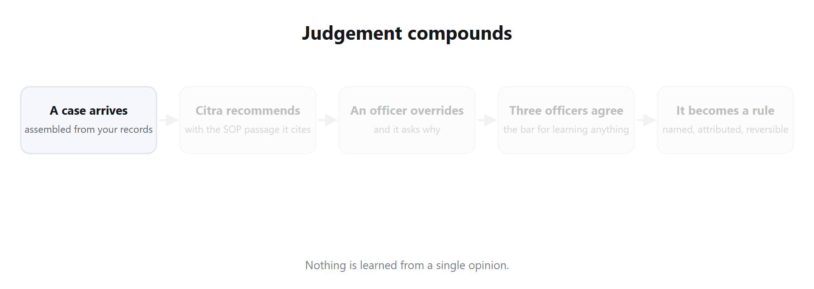
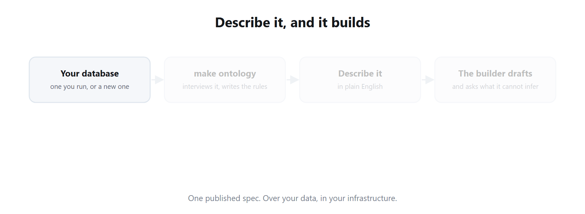

<!--
  Copyright (c) 2026 Trustedwear Tech Private Limited (https://citra-ai.com)
  Author: Rohit Kumar Chandan
  SPDX-License-Identifier: Apache-2.0

  Licensed under the Apache License, Version 2.0 (the "License"); you may not
  use this file except in compliance with the License. You may obtain a copy of
  the License at http://www.apache.org/licenses/LICENSE-2.0
-->

<p align="center">
  <picture>
    <source media="(prefers-color-scheme: dark)" srcset="assets/banner-dark.png">
    <source media="(prefers-color-scheme: light)" srcset="assets/banner-light.png">
    
  </picture>
</p>

<p align="center">
  <a href="https://github.com/Trustedwear-Tech/citra-decision-system/actions/workflows/ci.yml"></a>
  <a href="LICENSE"></a>
  
  
  <a href="https://discord.gg/tXHMcja67"></a>
</p>

<p align="center">
  <b><a href="#run-it-in-10-minutes">Quickstart</a> ·
  <a href="#describe-it-and-it-builds">Build an app</a> ·
  <a href="#it-learns-your-peoples-judgement">How it learns</a> ·
  <a href="https://github.com/Trustedwear-Tech/citra-decision-system/wiki">Docs</a> ·
  <a href="https://citra-ai.com">Website</a></b>
</p>

*Sovereign by design — run it in your own infrastructure, on open models. Your
data never leaves.*

<p align="center">
  <picture>
    <source media="(prefers-color-scheme: dark)" srcset="assets/story/0-hero-dark.svg">
    <source media="(prefers-color-scheme: light)" srcset="assets/story/0-hero-light.svg">
    
  </picture>
</p>

**AI still can't be trusted with the decisions that carry money — and the
model isn't the problem.**

What settles a hard case usually isn't in your systems. The SOP is written for
the average case. The tables hold fields, not reasons. The thing that actually
decides it lives in one experienced person's head, at the moment they decide
— so a model recommends confidently with nothing real behind it, and the
pilot stalls at exactly that point.

Citra closes that gap at the only place it exists: the decision itself.

**A complete decision system for the calls that carry real money — and it
learns the judgement of the people who make them.**

Describe the operation in plain English and it builds you a working enterprise
application over your own data: a case queue your team works in, an API your
existing systems call, or a card embedded in the screen they already use.
Point it at a database you run, or stand a new one up and plug it in.

Then it goes to work. Every case arrives assembled, analysed and scored, with
a recommended action and the reasoning behind it. The analysis a person would
otherwise do from scratch on every file is already done, and cited back to the
records and policy it came from. Your team approves or overrides,
**and it asks why.** That reason is captured, and the next matching case is
decided with it.

**The memory is part of the system, not a component you bolt on.** It sits in
your own database next to the decisions it came from, and it keeps growing
while your people work — no retraining, no model swap, no batch job. An
officer's judgement on Tuesday is being applied on Wednesday, and it stays
current for the same reason it got there: because your team kept deciding.

| | |
|---|---|
| **Lending** | approve, decline, or send for verification |
| **Insurance** | settle a claim, or investigate it |
| **Energy & utilities** | clear a substation for service, approve an equipment change |
| **Aviation & industry** | release a part, sign off an inspection |
| **Public services** | route a grievance, prioritise a case |

Anywhere being confidently wrong is expensive, and an experienced person is
the last line.

**Bounded by an ontology, and auditable end to end.** What the system may read,
may build, and may write back is declared up front in one reviewable file per
deployment — not inferred, and not learned. The agent never writes to your
systems on its own: every write is schema-validated and a person approves it,
with autonomy opt-in later and only where you choose. And every case is
recorded — the evidence assembled, the recommendation, the passages it cited,
who decided, what they overrode, and why. That record is in your own database,
in a schema you can read, which is what makes it something an auditor can be
shown rather than a claim about a model.

Two things come out of it: the **losses avoided** by getting the hard calls
right, and the **hours saved** by not re-analysing the easy ones. Most tools
chase the second. This is built for the first.

---

Your SOPs and your data already answer most cases. The ones carrying real
money are settled by an experienced person whose reasoning is written down
nowhere.

**You may already have tried fine-tuning a model for exactly these.** A
fine-tune learns the patterns in the records it was shown, and that is also
its ceiling. In a hard case the deciding factor usually is not in the data:
*the column that would settle it does not exist, and the SOP does not cover
this one.* That is the moment a person takes over, on judgement built over
years and applied exactly where the rules run out.

That judgement is the most valuable asset in the operation and the least
protected. **It lives in one head. It walks out of the door.** Citra puts it in
a ledger you own, and applies it to the next case.

This is a **decision system, not a vertical application** — it carries no
industry logic of its own. What a case is, what evidence counts, what may be
written back and by whom is declared per deployment, which is why the same
engine serves lending, insurance, energy, public services and logistics. The
demo ships as a bank because a runnable demo has to pick one.

→ [Why this exists](https://github.com/Trustedwear-Tech/citra-decision-system/wiki/Why-this-exists)

---

## It learns your people's judgement

Every recommendation arrives with the SOP passage or prior decision that
produced it, so an approver checks the reasoning rather than the answer. When
they override it, the reason is recorded.

**A correction is not a lesson.** One officer having a bad afternoon should
not change how the system decides. When the *same* corrected pattern repeats
across **three distinct officers**, it hardens into a learned judgement:
named, attributed, dated, and reversible. Not a silent weight update — a rule
you can read, cite, and switch off.

The next matching case is recommended against it.

<p align="center">
  <picture>
    <source media="(prefers-color-scheme: dark)" srcset="assets/story/loop-dark.gif">
    <source media="(prefers-color-scheme: light)" srcset="assets/story/loop-light.gif">
    
  </picture>
</p>


→ [How the learning loop works](https://github.com/Trustedwear-Tech/citra-decision-system/wiki/The-learning-loop) ·
[What the decision ledger records](https://github.com/Trustedwear-Tech/citra-decision-system/wiki/The-learning-loop#what-the-ledger-records)

---

## Describe it, and it builds

Say what you want in plain English. A builder agent drafts the spec against
your data catalogue, asks about what it cannot infer, and publishes when you
accept. One published spec, three ways to use it:

| | |
|---|---|
| **Decision App** | A working case queue: case pages, live dashboards, a plain-English copilot. |
| **API** | Every recommendation, score, reason and the learning loop itself, over REST. Call it from a system you already run. |
| **Embedded UI** | Drop the recommendation and its reasoning into your existing screen — LOS, CRM, core system. Your team never changes tools. |

A dashboard is not a fourth thing: it is an app whose primary page is a
dashboard rather than a case queue.

People have built claim triage, loan origination, asset-quality review,
grievance routing and operations dashboards this way. The shape of the work
does not change — only the ontology does.

<p align="center">
  <picture>
    <source media="(prefers-color-scheme: dark)" srcset="assets/story/build-dark.gif">
    <source media="(prefers-color-scheme: light)" srcset="assets/story/build-light.gif">
    
  </picture>
</p>

### Your data, described once

The system needs to know what your tables *mean* — which one records
decisions already made, what a document column actually is, which column is
money. A schema scan cannot infer that.

```bash
make ontology                # interviews a live database, writes sources.json
```

**Point it at a database you already run, or stand a new one up.** Spinning up
a database takes minutes; designing a schema that reflects your business takes
days. Everything after that — the ontology, the catalogue, the app, the API,
the embedded card, the governance, the learning — is what this repository is.

The result is one reviewable file per deployment. It is safe to commit; secrets
stay in the environment.

→ [Build an app, API or embedded UI](https://github.com/Trustedwear-Tech/citra-decision-system/wiki/Build-apps-APIs-and-embedded-UI) ·
[Connect your data](https://github.com/Trustedwear-Tech/citra-decision-system/wiki/Connect-your-data)

---

## Run it in 10 minutes

The wizard checks your host first and stops before writing anything if a
prerequisite is missing, asks for one API key, builds every image from source,
and seeds a worked bank demo: five departments, a policy corpus, and four
Decision Apps you can open and drive. A `git clone` works the same as the
download below.

Everywhere you need **Docker Engine 24+ with Compose v2**, **16 GB RAM**,
**Python 3.9+ with `venv`**, and an **OpenAI-compatible API key**. Node.js is
not required — it runs inside the containers. The rest differs by platform.

### Linux

```bash
curl -fsSL https://get.docker.com | sh          # Docker Engine + Compose v2
sudo usermod -aG docker "$USER" && newgrp docker
sudo apt install -y python3 python3-venv python3-pip curl make   # Debian/Ubuntu

curl -sSL https://github.com/Trustedwear-Tech/citra-decision-system/archive/refs/tags/v0.6.1.tar.gz | tar xz
cd citra-decision-system-0.6.1
make wizard
```

`python3-venv` is a separate package on Debian and Ubuntu, and the seed step
builds a virtual environment — a `python3` that is plainly installed will still
fail without it. The preflight check catches this before anything is written.

### macOS

```bash
xcode-select --install                          # provides make
brew install python                             # 3.9+ with venv
# Docker Desktop: https://www.docker.com/products/docker-desktop (includes Compose v2)

curl -sSL https://github.com/Trustedwear-Tech/citra-decision-system/archive/refs/tags/v0.6.1.tar.gz | tar xz
cd citra-decision-system-0.6.1
make wizard
```

### Windows

Install **Docker Desktop** (WSL 2 backend), **Git for Windows**, and **Python**
from python.org with *Add python.exe to PATH* ticked. Git for Windows is a real
requirement here, not an optional convenience: it supplies the shell the
installer runs in.

Then open **Git Bash** — not PowerShell, not Command Prompt:

```bash
curl -sSL https://github.com/Trustedwear-Tech/citra-decision-system/archive/refs/tags/v0.6.1.tar.gz | tar xz
cd citra-decision-system-0.6.1
./scripts/quickstart/wizard.sh
```

Three things that will otherwise cost you an afternoon:

- **PowerShell cannot run any of the above.** It has no `make`, and its `curl`
  is an alias for `Invoke-WebRequest`, which rejects these flags. Git Bash has
  a real `curl` and `tar`; it has no `make` either, which is why the Windows
  line calls the script directly instead.
- **`C:\Windows\System32\bash.exe` is the wrong bash.** That is the WSL
  launcher — it runs inside a different filesystem, with a different Docker
  socket, against a copy of the repository that is not the one you cloned. Use
  the Git Bash entry in your Start menu.
- **Keep the checkout on a local drive**, under your user profile. Docker
  Desktop bind mounts do not work from network or mapped drives, and the
  failure surfaces later as an empty container rather than a mount error.

> **The demo is a hypothetical Indian bank**, so screenshots show rupee
> amounts and Indian digit grouping. Nothing in the platform is tied to
> that: currency, date order and ID checksums come from the country pack,
> and packs ship for `IN` and `US` today.

**First run takes 20–40 minutes**, nearly all of it compiling images. Cached
after that.

Requirements are listed per platform above. The installer verifies every one
of them before it writes anything, and names the exact package to install when
one is missing.

→ [Install and first run](https://github.com/Trustedwear-Tech/citra-decision-system/wiki/Install-and-first-run) ·
[Troubleshooting](https://github.com/Trustedwear-Tech/citra-decision-system/wiki/Troubleshooting)

---

## What it looks like

Three screens, in the order the work happens. All from the demo the wizard
seeds, on a machine with nothing on it.

**The apps, built and published.** Four of them, from four sentences.

<p align="center">
  
</p>

**A recommendation, with its reasoning and the SOP it cites.** The approver
checks the argument, not just the answer.

<p align="center">
  
</p>

**What it has learned from your people.** Named, attributed, reversible — and
switchable off.

<p align="center">
  
</p>

→ [More screens](https://github.com/Trustedwear-Tech/citra-decision-system/wiki/Install-and-first-run)

---

## Does it actually work?

We wrote the evidence up as a credit-risk note rather than a claim in a
README. It works through a case from retail underwriting where every
documented gate passes and an experienced officer still says hold on —
because what she is applying was never written down, and the record has no
field for it.

From there: the controlled run we tested it with, the null result we found
beside it, the economics, the objections we get asked, how to prove it on
your own book, and a closing section on what the evidence does not cover.

→ **[Citra Decision Memory — Credit Note 01](https://github.com/Trustedwear-Tech/citra-decision-system/blob/main/docs/Citra-Decision-Memory-Credit-Note.pdf)**

---

## What makes it different

- **A governed ontology, not an open-ended agent.** What the system may build
  and do is bounded up front; every write is schema-validated before it runs.
- **Cited, precedent-backed recommendations.** Every recommendation links back
  to the SOP passage or prior decision that produced it.
- **The agent never writes on its own.** A person approves before anything
  reaches your systems. Autonomy is opt-in, later, and only where you choose.
- **File-defined data sources.** Each deployment reads its own `sources.json`
  — no central service holds your connection strings.
- **Connects to what you already run.** SQL, REST and document stores through
  MCP. No rip-and-replace.

→ [Governance and the sandbox](https://github.com/Trustedwear-Tech/citra-decision-system/wiki/Governance-and-the-sandbox) ·
[Architecture](https://github.com/Trustedwear-Tech/citra-decision-system/wiki/Architecture)

---

## Documentation

| | |
|---|---|
| [Install and first run](https://github.com/Trustedwear-Tech/citra-decision-system/wiki/Install-and-first-run) | Prerequisites per OS, the wizard, what gets built |
| [Build apps, APIs and embedded UI](https://github.com/Trustedwear-Tech/citra-decision-system/wiki/Build-apps-APIs-and-embedded-UI) | The builder, the three surfaces, embedding |
| [Connect your data](https://github.com/Trustedwear-Tech/citra-decision-system/wiki/Connect-your-data) | Databases, the ontology, the catalogue |
| [The learning loop](https://github.com/Trustedwear-Tech/citra-decision-system/wiki/The-learning-loop) | Judgements, clauses, precedent, the ledger |
| [Architecture](https://github.com/Trustedwear-Tech/citra-decision-system/wiki/Architecture) | Services, data flow, what talks to what |
| [Governance and the sandbox](https://github.com/Trustedwear-Tech/citra-decision-system/wiki/Governance-and-the-sandbox) | Policy gates, approvals, isolation |
| [Why this exists](https://github.com/Trustedwear-Tech/citra-decision-system/wiki/Why-this-exists) | The argument: why a fine-tune does not close it |
| [The experiment](https://github.com/Trustedwear-Tech/citra-decision-system/blob/main/docs/Citra-Decision-Memory-Credit-Note.pdf) | Method, results, the null result, limits |
| [Configuration](https://github.com/Trustedwear-Tech/citra-decision-system/wiki/Configuration) | Every environment variable |
| [Operations](https://github.com/Trustedwear-Tech/citra-decision-system/wiki/Operations) | Running it, upgrading, health |
| [Backups](https://github.com/Trustedwear-Tech/citra-decision-system/wiki/Backups) | What holds state, the backup sidecar, restore, the restore drill |
| [Observability](https://github.com/Trustedwear-Tech/citra-decision-system/wiki/Observability) | Metrics, logs, traces and alerts; off by default |
| [OIDC login](https://github.com/Trustedwear-Tech/citra-decision-system/wiki/OIDC-login) | Your own IdP, with directory groups driving departments and roles |
| [Troubleshooting](https://github.com/Trustedwear-Tech/citra-decision-system/wiki/Troubleshooting) | When something will not start |

---

## Community edition and Citra Enterprise

**Community is a complete, working decision system for one team running one
deployment.** Not a demo tier and not a crippled one: the builder, the runtime,
the governed ontology, the decision ledger, the memory curation UI and the
automation controls are all here, all Apache-2.0. You can see what the system
has learned, retire a judgement, exclude a precedent, read loop health, and
start or stop every automated job, because a decision system you cannot inspect
or switch off is not one anybody should run. Deploy it on your own
infrastructure and operate it forever without ever talking to us.

The licence does not limit how you use it. The design does: Community is one
deployment, one node per service, one memory curated by its own officers, and
observability you switch on yourself. The moment there is a second team with
its own seniority levels, a second deployment to keep in step, or a memory too
large to curate by hand, you are in Enterprise territory.

**Citra Enterprise is a premium software product, not Community with a support
contract.** It is built on these foundations and adds what a regulated
institution's risk, audit and technology committees ask for before a system
that writes decisions is allowed into production. We call it Core+ and Memory+:

- **Core+** is control and operation at organisation scale. In Community a
  builder composes every control inside each app: maker-checker, approval
  queues, row filters from the rules a business analyst gives. Core+ defines
  them once for the organisation, in a registry of seniority levels, sanction
  limits, segregation-of-duties rules and delegations, and the platform
  enforces that registry across every app at the data layer, with an
  attestation an auditor can read. It adds a shared case object across apps
  (ownership, lifecycle, turnaround clocks, communication), versioned apps
  with rollback and a validation record, a fleet console that operates many
  deployments as one estate, and blast-surface management, meaning halt,
  pause and roll back across that estate from one place.
- **Memory+** is judgement memory with a managed lifecycle. Retention and
  erasure policies that a data-protection officer can sign, an officer's
  corrections removed with a re-fold of what they taught, statistical drift
  detection run as a job, champion and challenger runs, a tuning surface for
  promotion and merge thresholds, and memory health across every deployment.

| | Community (Apache-2.0) | Citra Enterprise (Core+ / Memory+) |
|---|---|---|
| **Built for** | One team, one deployment | Many teams, many apps, many deployments, run as one estate |
| **Decision engine, builder, ontology, ledger** | Complete and production-ready | The same engine, plus everything below |
| **Control** | Six roles (user, IT workflow, decision-app builder, department admin, org admin, super admin) at department and org scope. The builder composes any control as app logic: maker-checker, approval queues, four-eyes review, an approver list with no self-approval, and row filters from the rules a business analyst gives (who sees which rows, up to what amount). Business users build too, and publish to whoever they choose (owner, team, department, org). Every control sits on the app card. Each app carries its own controls | The same controls defined once for the organisation: a registry of seniority levels, sanction limits, segregation-of-duties rules and delegations, enforced by the platform across every app at the data layer whatever a builder wrote, with an attestation an auditor can read showing every app is covered |
| **Case operations** | The builder composes case handling inside each app: assignment, stages, pending states, reminders and turnaround as pages and fields of that app | A shared case object across apps and deployments: ownership and locks, lifecycle stages and hand-offs, turnaround clocks and ageing, conditional and partial decisions, customer and partner communication, managed once and reported across the estate |
| **Memory** | Full curation UI: judgements, precedents, provenance, loop health, retire, quarantine, challenge and adjudicate, precedent exclusion. Automated consolidation that merges, supersedes, detects contradictions and demotes on measured precision. Facet and SOP drift shown on read. Promotion threshold per app. Export to your bucket | Memory+: retention and erasure policies, officer erasure with re-fold, statistical drift as a scheduled job, threshold tuning UI, memory health across deployments |
| **Model governance** | One live spec per app, test and prod environments, promote when ready | Versioned apps with rollback, a validation record per version for the model-risk file, champion and challenger runs, approval workflow for a change to a live app |
| **Assurance** | Tamper-evident hash-chained run ledger, append-only. Ledger and memory export. One reason per decision | Chain verifier, signed exports, audit packs and regulator-ready reports. A customer-facing reason, an audit reason and a regulatory code from each decision |
| **Impact measurement** | Success Rate: recommendations accepted, accepted with changes, rejected and automated, kept apart; memory lift when both cohorts are large enough. Money Impact: value summed under your own frozen definition, with the decisions that could not be valued shown, and no invented baseline | Success Rate+: accuracy against settled outcomes, rubber-stamp and automation-bias detection, officer agreement by level, control charts with root cause, causal memory lift, champion and challenger, a regulator monitoring report. Money Impact+: lift measured over a holdout, net value after cost, value attributed to judgements and officers, realisation curves, finance close and sign-off |
| **Fraud screening** | Deterministic checks (format and checksum validators, record-versus-document cross-check, invoice arithmetic), duplicate and near-duplicate artifacts across cases, EXIF and PDF metadata anomalies, entity links, gated reasoning on flagged cases, a calibration report and the Screening Health card. Off by default and switched on per source by hand, because untuned checks raise false alarms. Findings are evidence on the recommendation, never an auto-reject | Fraud+: calibrated in shadow mode on your own history before exposure, measured precision per check shown on every finding, a false-alarm budget with automatic demotion, entity networks and velocity across applications and claims, channel risk for dealers, agents and surveyors, lending and claims pattern models, document forensics, investigation cases with evidence packs and regulator report templates |
| **Forecasting** | Dashboard forecasting the builder composes from your data: KPI metrics with period-over-period deltas and trend sparklines, line and area charts, and projections written as formulas over the series (moving averages, run-rates, seasonal comparisons), per app | Trained models, not formulas: default and early-payment risk on each application, roll-rate early warning per account, expected recovery per action, claim reserve and settlement-time estimates per claim, each backtested, calibrated, versioned and drift-monitored inside your deployment and shown as evidence on the recommendation, never as a decision. Staffing forecasts against turnaround targets, expected value of the pending backlog, and what-if replay of a policy or limit change against the ledger before it is made |
| **Identity** | Local login, Google, and OIDC (Okta, Azure AD, Auth0, Keycloak) with IdP group to department and role sync on every login | SAML, SCIM provisioning, MFA enforcement, session management and revoke-all, login and failed-auth audit |
| **Automation and estate** | Cron, interval, poll and webhook triggers; recommend or auto-process with a fail-closed policy; test and prod isolation; kill switches at global, org, department and app scope; an operations console over every app on the deployment | Fleet console and blast-surface management across every deployment: halt, pause and roll back the estate from one place |
| **Scale** | One node per service on Compose. Redis cache and a Redis-backed job queue with consumer groups and dead-letter, multi-worker containers, replica-safe rate limits and leader election. Terraform for multi-AZ Compose on EC2 | Kubernetes and Helm, clustered and sharded vector tier, per-tenant quotas, capacity planning |
| **Observability** | Prometheus, Grafana, Loki, Tempo and Alertmanager with provisioned dashboards, shipped as an optional stack you set up yourself. Off by default | Observability+: on by default, decision-level telemetry (per app, per officer, per judgement), tuned alerting, and a single pane across deployments |
| **Security** | Vault AppRole secret loading, CodeQL and secret scanning in CI, SBOM on release | Encryption at rest with your KMS or HSM, signed images and pinned digests, air-gapped install with local inference |
| **Resilience** | Snapshot backups on a schedule with an automated restore drill; up to one interval of loss (six hours by default); Mongo replica set | Recovery time and recovery point commitments in the contract, point-in-time restore, DR, multi-region |
| **Hosting** | Your infrastructure | Dedicated private cloud, ours or yours (BYOC), single-tenant either way |
| **SLA and maintenance** | Community issues | Contracted uptime and response, upgrades, migrations, patching |
| **Roadmap** | Community roadmap | Prioritised engineering against the workflows you actually run |

Community is not a trial of Enterprise, and nothing is taken out of it.
Improvements to the shared foundation land here; the Core+ and Memory+
capabilities are Enterprise software and stay there. If you are one team with
one deployment, Community is the right edition and we will not try to talk you
out of it. Setup and deployment, ontology authoring and custom development are
quoted separately.

Talk to us at **[citra-ai.com](https://citra-ai.com)** or contact@citra-ai.com
— or just ask in
[Discord](https://discord.gg/tXHMcja67).

---

## Support this project

Citra Decision System is Apache-2.0 and free to run on your own infrastructure,
forever. If it saves you a build, [supporting the
work](https://citra-ai.com/open-source) keeps it maintained and independent.

## License

Apache-2.0. See [LICENSE](LICENSE). Use it in production, commercially, without
asking. The `citra-common` packages vendored under `citra-common/` are
Apache-2.0 too.

## Community

Questions and bug reports: [Issues](https://github.com/Trustedwear-Tech/citra-decision-system/issues).
Conversation: [Discord](https://discord.gg/tXHMcja67).

## About

Built by [Trustedwear Tech Private Limited](https://citra-ai.com) ·
contact@citra-ai.com
