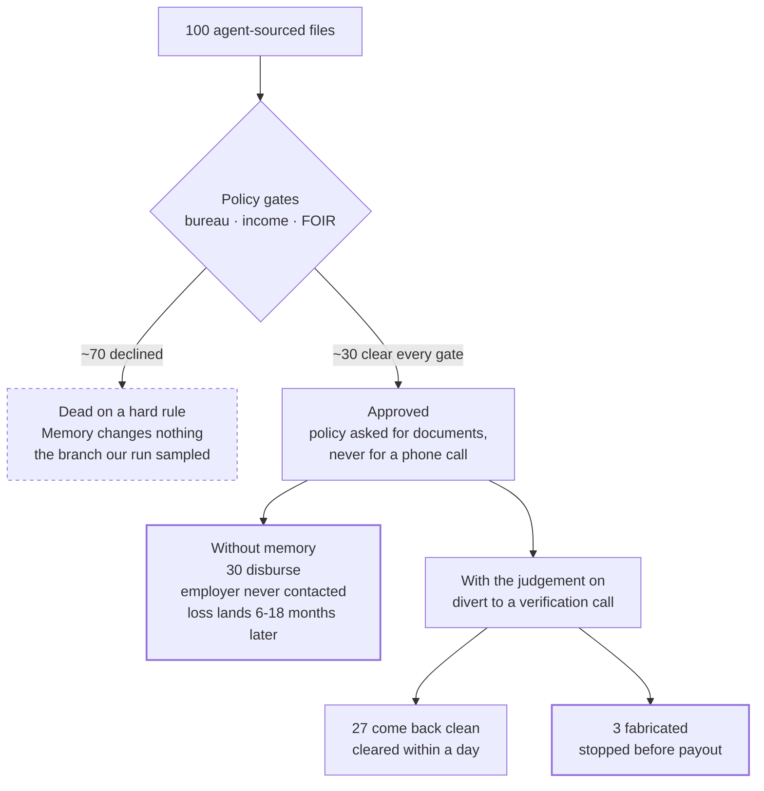

<!-- Copyright (c) 2026 Trustedwear Tech Private Limited (https://citra-ai.com)
     SPDX-License-Identifier: Apache-2.0 -->

## What we measured

**Can a system learn something from a person that exists in no document -- and
then apply it to exactly the right cases?**

That is what this experiment answers, and you can reproduce it.

Full write-up, with the worked policy example and the arithmetic:
**[Citra Decision Memory -- Credit Note 01](https://github.com/Trustedwear-Tech/citra-decision-system/blob/main/docs/Citra-Decision-Memory-Credit-Note.pdf)**
(PDF, 10pp).

### Why it is hard to test

Teach a system a rule already written in the policy, and correct behaviour
proves nothing -- it may simply have read the rule. **The test has to use
knowledge that appears in no document the system can see.**

### What we taught it

In Indian retail lending, sourcing agents are paid when a loan is disbursed,
not when it is repaid. Experienced officers know what that incentive
produces, so on agent-sourced files they ring the employer directly and
confirm the borrower's job is real.

We took that judgement from **three different credit officers** and gave it
to the system as one instruction:

> On files sourced through an agent, verify employment with the employer
> directly. The submitted document set is not enough.

It is in no credit policy. The policy says it applies to every sourcing
channel, then prescribes nothing channel-specific -- so **nothing the system
can read tells it to treat these files differently.** If behaviour changes,
reading is not the explanation.

The case record has a field for whether an income document is *present*.
None for whether it is *true*.

### The run

**Nineteen agent-sourced applications, each run twice.** Identical inputs.
One difference: the judgement on, then off. Then the opposite test --
**control files from other channels**, where the right behaviour is to do
nothing.

| Result | |
|---|---|
| **14 vs 1** | check raised on 14 files with memory on, 1 with it off |
| **19 of 19** | applied on every file it was meant for |
| **0 of 2** | never fired on a control file |
| **p = 0.0005** | odds of this being luck: about 1 in 2,000 |

It fires where it belongs, stays silent where it does not, and the effect is
not the underlying model.

### Where the money is

Take 100 agent-sourced files through the policy gates.

**About 70 fail a hard rule and are declined** -- bureau 617, FOIR 95%,
income below floor. Memory changes nothing here. A file already dead on a
hard rule cannot be saved by better reasoning. **This is the branch our run
sampled**, which is exactly why no verdict moved in it.

**About 30 clear every gate and get approved.** The policy asked for
documents. It never asked anyone to pick up the phone. So they disburse, the
employer is never contacted, and the losses surface six to eighteen months
later as principal, provisioning and collection cost.

**With the judgement switched on, those 30 get diverted to a verification
call.** 27 come back clean and clear within a day. **3 are fabricated and
stop before payout.**

On a ₹5 lakh ticket that is **₹15 lakh that never leaves the bank -- for the
cost of 30 phone calls.**

*Catch counts are arithmetic on a 100-file cohort. The 14-of-19 marker is
measured.*

### The null result

We seeded **four** judgements. Three restated the written policy. **Retired,
they changed nothing** -- the system reached the same conclusion without
them, because it could read the rule.

That is published deliberately. It is what makes the fourth believable, and
it draws the line exactly: **this is not a rulebook engine. It is the layer
for what the rulebook never covered.**

### Run it on your own data

1. Point it at decided cases, with documents and outcomes.
2. Write **one** judgement your officers apply and your policy does not
   contain.
3. Run them twice -- memory on, memory off.
4. Add control cases it should not touch.
5. Read the reasoning, not only the verdicts.

Clauses are seeded, inspected and retired through the endpoints in
[The memory](Connect-your-data);
the stack itself comes up with [Quickstart](Install-and-first-run) below.
**If it does not reproduce, [open an issue](https://github.com/Trustedwear-Tech/citra-decision-system/issues)**
-- a result that only works in our hands is not a result.

### Limits

One judgement, one application, nineteen cases, one tenant. It is evidence
that a learned judgement changes how the system reasons where policy is
silent, and stays quiet where it is not. It is **not** evidence that decision
memory helps in general, and we would not present it as such. The run tested
a single-facet scope (the sourcing channel); it says nothing about how well
multi-facet scopes discriminate, which we have not measured. Every rupee
figure above is arithmetic on a single ticket size and a flat
loss-given-default -- a real book has a distribution for both.

---

## The problem it addresses

Every organisation that makes consequential decisions at volume has the same
queue: cases arrive, rules are applied, and a handful of them need a person who
knows better than the rules. That person is the whole system, and nobody has a
copy of them.

  

<i>A real run on the bundled demo. The recommendation cites the sections it relied on, the fraud check is stated rather than implied, and the write is <b>staged</b> — "review the plan below and Apply to commit" — not executed.</i>

The same structure, five industries:

- A **credit officer** declines a file that passes every policy gate, because
  it came through a channel whose incentive is disbursal rather than repayment.
- A **claims assessor** recognises a repair estimate as inflated before any
  threshold fires, from the pattern of the workshop and the photographs.
- A **grid engineer** refuses to re-energise a feeder that reads healthy,
  because of what the last three faults on that line had in common.
- A **compliance analyst** escalates a set of payments that are each
  individually legal and collectively laundering.
- A **logistics or defence planner** overrides a routing that is optimal on
  paper, because the corridor's risk is not in any field the system holds.

Different sectors, one shape: **the rules cleared it, and a human knew better.**
Written policy captures the rules. It was never built to capture the judgement
applied once the rules run out -- and that judgement is what an institution
loses every time the person holding it leaves. It lives in one head, it is
never written down, and it walks out of the door.

### Why a better model does not close this

The gap is narrower and stranger than "the AI needs to be smarter".

Look at what any of these systems actually holds per case. A loan application
has an amount, a tenure, a sourcing channel, a declared income, a status. There
is no field for *is this employment real*. A feeder has a load profile, a fault
count, an age. There is no field for *has this line been patched badly before*.
The closest column records that a document or a reading exists -- nothing
distinguishes **the record is present** from **the record is true**.

**The signal is not in the columns. It is in a column nobody thought to
create.** That is why a model trained harder on the same fields cannot close
the gap: it can price the uncertainty as a slightly worse score, but it cannot
recommend *acquiring evidence that exists nowhere in its training data*. A
person can, and does, every day.

Citra's job is to capture that person's move -- once -- and replay it on every
matching case afterwards, in whatever sector the queue happens to be.

## Why the obvious answers don't close it

- **Copilots.** AI proposes, a person acts. The reasoning stays in that
  person's head -- nothing the organisation can replay, audit, or build on.
  After two years of copilot usage you own nothing.
- **Agents.** Systems that act without a governed envelope and without a
  record: unbounded risk going in, nothing to learn from coming out.
- **Fine-tunes.** A fine-tune buries judgement inside model weights. It holds
  patterns, not reasons; it cannot cite the past case that justified a call;
  and it does not survive a model swap with its reasoning intact.

The missing layer in all three is the same: **a decision memory you own,
independent of any model.**
